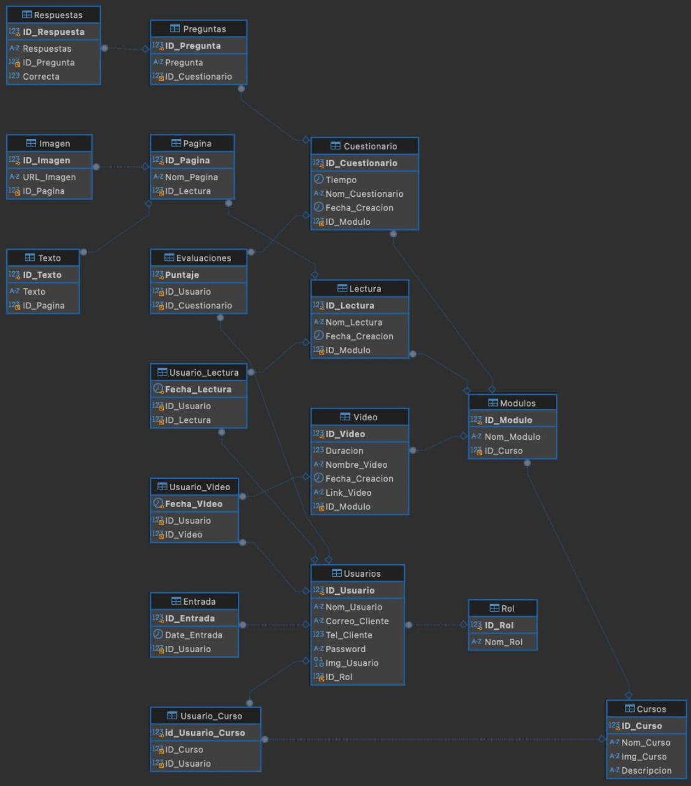

### Despliegue de la Base de Datos

### Cuestionario
| Campo            | Dominio                              |
| ---------------- | ------------------------------------ |
| ID_Cuestionario  | Número entero                        |
| Tiempo           | Tiempo (00:00:00 - 23:59:59)         |
| Nom_Cuestionario | Cadena de caracter de longitud 100   |
| Fecha_Creacion   | Fecha y hora ('YYYY-MM-DD HH:MM:SS') |
| ID_Modulo        | Número entero                        |

### Cursos
| Campo       | Dominio                           |
| ----------- | --------------------------------- |
| ID_Curso    | Número entero                     |
| Nom_Curso   | Cadena de caracter de longitud 25 |
| Img_Curso   | text(URL)                         |
| Descripcion | text (Máximo 65.535 caracteres)   |

### Entrada
| Campo        | Dominio                              |
| ------------ | ------------------------------------ |
| ID_Entrada   | Número entero                        |
| Date_Entrada | Fecha y hora ('YYYY-MM-DD HH:MM:SS') |
| ID_Usuario   | Número entero                        |

### Evaluación
| Campo           | Dominio               |
| --------------- | --------------------- |
| ID_Usuario      | Número entero         |
| Puntaje         | Número entero (0-100) |
| ID_Cuestionario | Número entero         |

### Imagen
| Campo      | Dominio       |
| ---------- | ------------- |
| ID_Imagen  | Número entero |
| URL_Imagen | text(URL)     |
| ID_Pagina  | Número entero |

### Lectura
| Campo          | Dominio                              |
| -------------- | ------------------------------------ |
| ID_Lectura     | Número entero                        |
| Nom_Lectura    | text (Máximo 65.535 caracteres)      |
| Fecha_Creacion | Fecha y hora ('YYYY-MM-DD HH:MM:SS') |
| ID_Modulo      | Número entero                        |

### Modulos
| Campo      | Dominio                         |
| ---------- | ------------------------------- |
| ID_Modulo  | Número entero                   |
| Nom_Modulo | text (Máximo 65.535 caracteres) |
| ID_Curso   | Número entero                   |

### Pagina
| Campo      | Dominio                           |
| ---------- | --------------------------------- |
| ID_Pagina  | Número entero                     |
| Nom_Pagina | Cadena de caracter de longitud 50 |
| ID_Lectura | Número entero                     |

### Preguntas
| Campo           | Dominio                            |
| --------------- | ---------------------------------- |
| ID_Pregunta     | Número entero                      |
| Pregunta        | Cadena de caracter de longitud 100 |
| ID_Cuestionario | Número entero                      |

### Respuestas
| Campo        | Dominio                            |
| ------------ | ---------------------------------- |
| ID_Respuesta | Número entero                      |
| Respuestas   | Cadena de caracter de longitud 100 |
| Correcta     | bool(true/false)                   |
| ID_Pregunta  | Número entero                      |

### Rol
| Campo   | Dominio                           |
| ------- | --------------------------------- |
| ID_Rol  | Número entero                     |
| Nom_Rol | Cadena de caracter de longitud 20 |

### Texto
| Campo     | Dominio                         |
| --------- | ------------------------------- |
| ID_Texto  | Número entero                   |
| Texto     | text (Máximo 65.535 caracteres) |
| ID_Pagina | Número entero                   |

### Usuario_Curso
| Campo            | Dominio       |
| ---------------- | ------------- |
| ID_Usuario_Curso | Número entero |
| ID_Curso         | Número entero |
| ID_Usuario       | Número entero |

### Usuario_Lectura
| Campo         | Dominio                              |
| ------------- | ------------------------------------ |
| Fecha_Lectura | Fecha y hora ('YYYY-MM-DD HH:MM:SS') |
| ID_Usuario    | Número entero                        |
| ID_Lectura    | Número entero                        |

### Usuario_Video
| Campo       | Dominio                              |
| ----------- | ------------------------------------ |
| Fecha_Video | Fecha y hora ('YYYY-MM-DD HH:MM:SS') |
| ID_Usuario  | Número entero                        |
| ID_Video    | Número entero                        |

### Usuarios
| Campo          | Dominio                            |
| -------------- | ---------------------------------- |
| ID_Usuario     | Número entero                      |
| Nom_Usuario    | Cadena de caracter de longitud 100 |
| Correo_Cliente | Cadena de caracter de longitud 100 |
| Tel_Cliente    | Número entero                      |
| Password       | Cadena de caracter de longitud 15  |
| Img_Usuario    | text(URL)                          |
| ID_Rol         | Número entero                      |

### Video
| Campo          | Dominio                              |
| -------------- | ------------------------------------ |
| ID_Video       | Número entero                        |
| Duracion       | float                                |
| Nombre_Video   | Cadena de caracter de longitud 50    |
| Fecha_Creacion | Fecha y hora ('YYYY-MM-DD HH:MM:SS') |
| Link_Video     | text(URL)                            |
| ID_Modulo      | Número entero                        |

